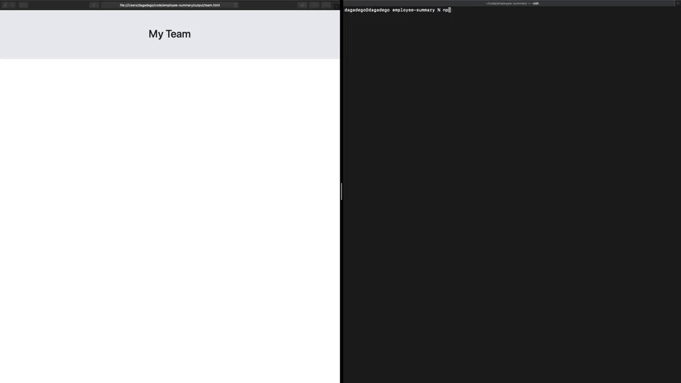

# 10 Employee Summary
## Description
Add your development team through the command line and display it as an html file for ease of access and use.
## Table Of Contents
* [Screenshot](#screenshot)
* [Installation](#installation)
* [Usage](#usage)
* [Contributing](#contributing)
* [Credits](#credits)
* [License](#license)
## Screenshot

## Installation
1. Make sure you have nodejs and npm installed on your local machine
1. Clone this repo onto your local machine
2. Open your command line and cd to the cloned folder
3. Run "npm install" to install all dependences
4. Done!
## Usage
node app.js
## Contributing
* Maged Abdelsalam
* Steve from Trilogy
## Tests
npm run test
## Questions
* Email me at hello@magedabdelsalam.com
* [magedabdelsalam](https://github.com/magedabdelsalam)
## License

